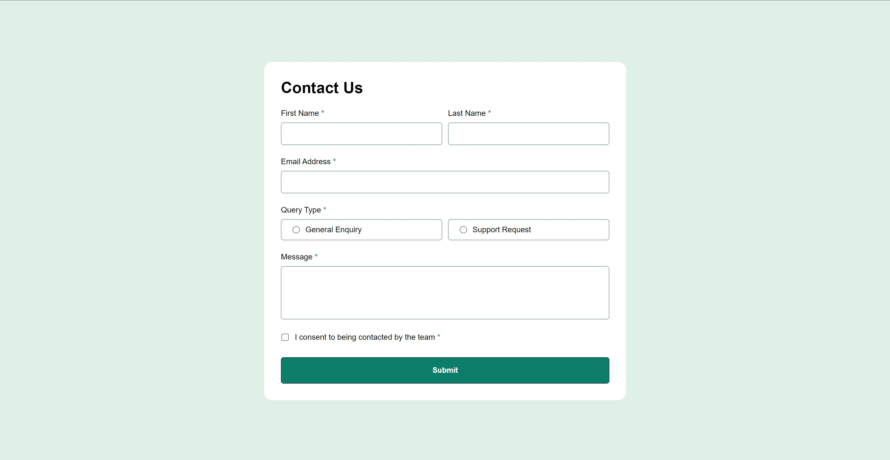
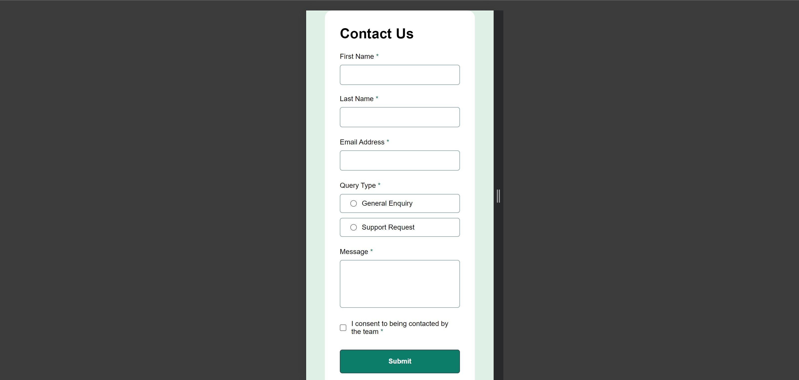

# Frontend Mentor - Contact form solution

This is a solution to the [Contact form challenge on Frontend Mentor](https://www.frontendmentor.io/challenges/contact-form--G-hYlqKJj). Frontend Mentor challenges help you improve your coding skills by building realistic projects.


[](https://app.netlify.com/sites/contact-form-front-end-mentor/deploys)
  
 


## Table of contents

- [Overview](#overview)
  - [The challenge](#the-challenge)
  - [Screenshot](#screenshot)
  - [Links](#links)
- [Installation](#installation)
- [My process](#my-process)
  - [Built with](#built-with)
  - [What I learned](#what-i-learned)
  - [Continued development](#continued-development)
  - [Useful resources](#useful-resources)
- [Roadmap](#roadmap)
- [Contributing](#contributing)
- [Author](#author)
- [Acknowledgments](#acknowledgments)

## Overview

### The challenge

Users should be able to:

- Complete the form and see a success toast message upon successful submission.
- Receive form validation messages if:
  - A required field has been missed.
  - The email address is not formatted correctly.
- Complete the form only using their keyboard.
- Have inputs, error messages, and the success message announced on their screen reader.
- View the optimal layout for the interface depending on their device's screen size.
- See hover and focus states for all interactive elements on the page.

### Screenshot





### Links

- [Solution URL](https://www.frontendmentor.io/solutions/contact-form-3uTuMRWuTn)
- [Live Site URL](https://contact-form-front-end-mentor.netlify.app/)

## Installation

To run this project locally, follow these steps:

1. Clone the repository:
   ```bash
   git clone https://gitlab.com/Yashi-Singh-9/contact-form.git
   ```
2. Navigate to the project directory:
   ```bash
   cd contact-form
   ```
3. Open the `index.html` file in your browser:
   ```bash
   open index.html
   ```

## My process

### Built with

- Semantic HTML5 markup
- CSS custom properties
- Flexbox
- Mobile-first workflow
- Vanilla JavaScript

### What I learned

Working on this project reinforced the importance of accessibility and user experience in form design. I learned how to create custom validation messages and implement a success toast notification after form submission.

### Continued development

In the future, I plan to:

- Improve the accessibility of the form by adding ARIA attributes.
- Refactor the JavaScript code to make it more modular and reusable.
- Explore more advanced validation techniques, such as real-time validation.

### Useful resources

- [MDN Web Docs](https://developer.mozilla.org/en-US/) - MDN's documentation on form validation was incredibly helpful in understanding how to implement custom validation messages.
- [CSS Tricks](https://css-tricks.com/) - A great resource for CSS techniques that helped me with styling the form.

## Roadmap

- [ ] Add ARIA attributes for enhanced accessibility.
- [ ] Implement real-time validation for form inputs.
- [ ] Create unit tests for the form validation functions.
- [ ] Explore the use of a JavaScript framework like React for state management.
- [ ] Add animations for form transitions and error messages.

## Contributing

Contributions are welcome! If you have suggestions or improvements, please fork the repository and create a pull request. Here's how:

1. Fork the Project
2. Create your Feature Branch (`git checkout -b feature/AmazingFeature`)
3. Commit your Changes (`git commit -m 'Add some AmazingFeature'`)
4. Push to the Branch (`git push origin feature/AmazingFeature`)
5. Open a Pull Request

## Author

- Frontend Mentor - [@Yashi-Singh-9](https://www.frontendmentor.io/profile/Yashi-Singh-9)
- LinkedIn - [Yashi Singh](https://www.linkedin.com/in/yashi-singh-b4143a246)

## Acknowledgments

I’d like to thank the Frontend Mentor community for providing valuable feedback and resources throughout the development of this project.
